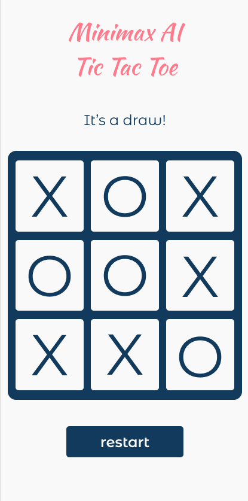

# Tic Tac Toe Web-App
A tic tac toe game written in HTML5/CSS3/Javascript using the minimax AI and javascript module pattern.

## Specification
- create a tic tac toe game in javascript, html, css
- user should be player 1
- AI (minimax algorithm) will be player 2
- Mobile first minimalistic design with figma
- use CSS grid and flexbox for layout
- avoid global namespace polution by using the revealing module pattern
- if you need multiples of the same prototype, use factory functions

## Project Road Map
- [x] create a basic README layout, add folders and css reset file
- [x] create a wireframe for the interface
- [x] create a figma layout for mobile (desktop will be a variation of it): 
- [ ] plan out the web app with a flowchart and determine which classes/ids, objects, functions and modules (what they will reveal) you'll approximately need
- [x] create the html+css static layout
- [ ] write a javascript base game where player 1 is the user, and player 2 chooses random cells for its moves (player 2 will be a bot)
- [ ] write out the winning logic condition
- [ ] display winner and ideally show what the winning row/diagonal is
- [ ] program how the new round will be started after the win
- [ ] add the AI (if you dare)

## Learning goals
- practice planning and organizing projects from start to finish (top down or bottom up, which suits the situation better?)
- how to use the module pattern in javascript to organize your code
- how to use factory functions + prototypal inheritance
- practice debugging in developer tools
- make the user experience as fluid and as simple as possible
- understand and implement the minimax algorithm in a project (which is the foundation of game theory and AI)
- learn about basic graphs in programming and some concepts how to traverse them
- use emmet shortcuts to speed up your HTML composing
- add unit tests with the jest framework to make the code more maintainable and avoid constant manual testing

## Unexpected Difficulties/Learning Experiences
- minimax is pretty hard to understand if you don't understand graphs, so that led me down the graphs rabbit hole and AI articles + courses
- implementing game states in code was also not trivial

